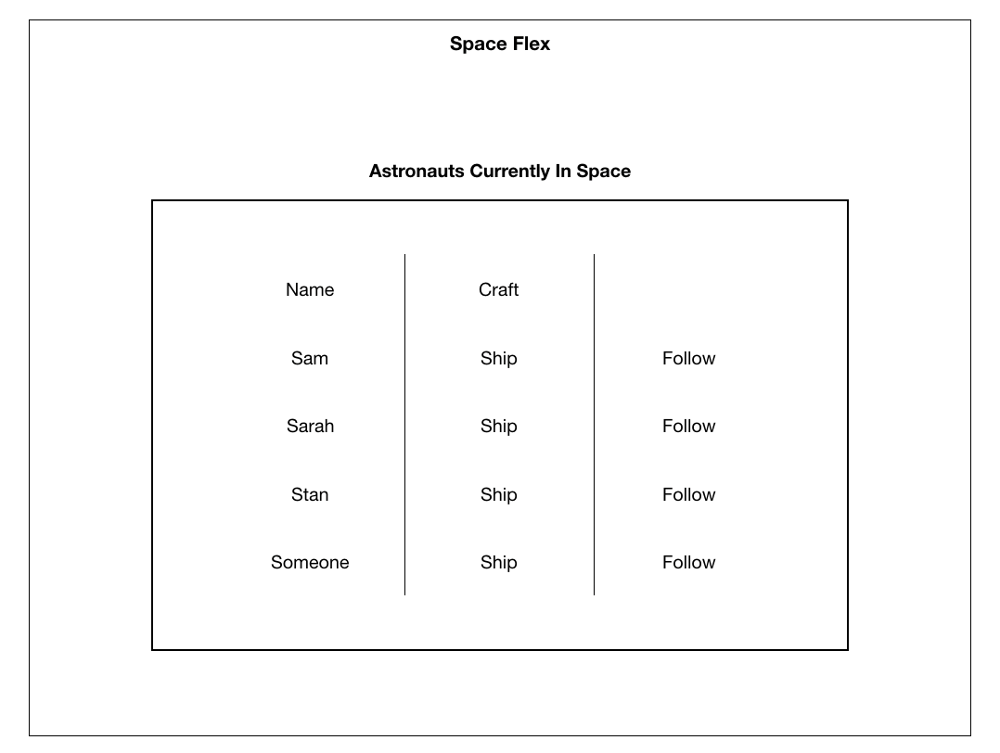

# SPACE FLEX

This is the client-side repository for Space Flex, where you can flex your space knowledge by learning about the astronauts in space and the current location of the International Space Station.

For server-side repository, please visit the following link: [space-flex-server](https://github.com/kennansalisbury/space_server).

## Tech stack and dependencies/APIs used on the Front End
* React.js
* Sass (scss)
* Material-UI
* Google Maps API
* Open Notify API
* Font Awesome Icons

## Requirements/User Flow
1. Unauthenticated users are directed to a login page that welcomes them to the application and implements a 3rd party Single Sign On authentication of choice.
2. Unauthenticated users trying to access any other resources are redirected to login page.
3. Once authenticated, user lands on a main page that welcomes them with some personal info found in their login info.
4. Once authenticated, the user is presented with menu options:
    * Profile (renamed to Home) - redirects them to their welcome page with profile information.
    * Astronauts - A page retrieves the current astronauts in space available at the URL.  It should display a table with two columns containing the data for the “Astronaut Name” and the “Craft” they are located on.
    * ISS Location - A page with a map showing the current position of the International Space Station.
    * Logout - logs the user out and redirects them back to the login page.

## Front End Routes
| Column Name | Data Type | Notes | 
| ------ | ------------ | --------------------------- |
| route | page | purpose/notes |
| /login | login page | unauthenticated users will be directed here to sign in using their Twitter account |
| /authorize | authorization interstitial | users will see a brief loading page here while the backend authorizes their account |
| / | home landing page | home/profile landing page can be access by authenticated users only |
| /astronauts | astronauts page | retrieves data from API and serves up the current astronauts in space along with a link to their Twitter profile |
| /iss | iss location page | retrieves ISS location data from API and displays using the Google Maps API |

## High Level App Structure Planning

## Wireframe planning
### Login

### Home/Profile

### View Astronauts

### View ISS Location

### Menu
